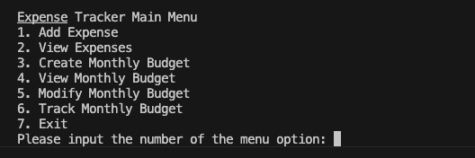
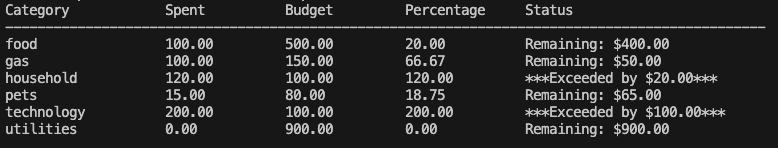
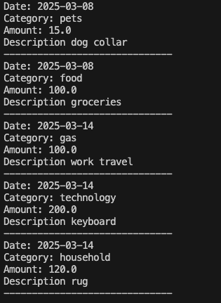

# expense_tracker
Project 1, Python

## Description
This is a beginner cli application using Python to track a monthly budget.  User input data is saved in csv files.
## Running the Program
Python 3 is required.  Only built-in libraries are used so no additional installation is required.  Open the file in an IDE, open a terminal and run "python proj1_expense_tracker.py" in command line and the menu will appear. The old notebook is kept in the repo for testing but is not for using the whole program.
## Usage
No user authentication is designed here so this program is for one user.  User can add expenses and associate them with categories.  They can create and view a monthly budget based on categories. They can also track their budget to see total monthly expenses in comparison to their monthly budget.
## Resources/Development
Initially, the functions were developed and tested in google colab notebooks before being copied over to VS Code for final .py file.  Watching class videos and researching Python on W3 Schools was the best resource.
## Further Development
This program would be better served with a more professional user interface and user authentication.  More functions could be added like deleting or modifying expenses.  The data should be better structured to categorize multiple months and years.  Function for viewing expenses should have the option to narrow down one category.
## Testing
Code blocks were tested in increments in a colab notebook by calling the function and passing arguments if applicable and printing the results.  Once each function worked properly, testing involved both direct function calls in notebook and testing the full application using the CLI.  Git branching was used to work on some of the new functions so the file could be tested as a whole before implementing the new functions.
## Links and Visuals
Github Repository: https://github.com/aliehs111/expense_tracker

